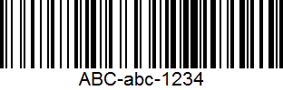
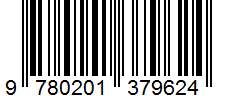

# Barcode Scanner for Xamarin Forms
## Español
Este proyecto es el ejemplo usado en mi publicación en Xamarin Latino acerca de como implementar un escaner de código de barras en una aplicación Xamarin Forms. 

## English
This project is an example used on my post from Xamarin Latino about how to implement a barcode scanner in a Xamarin Forms app.

## Barcodes used
### CODE 128

### EAN 13

### QR Code (Simple Text)

